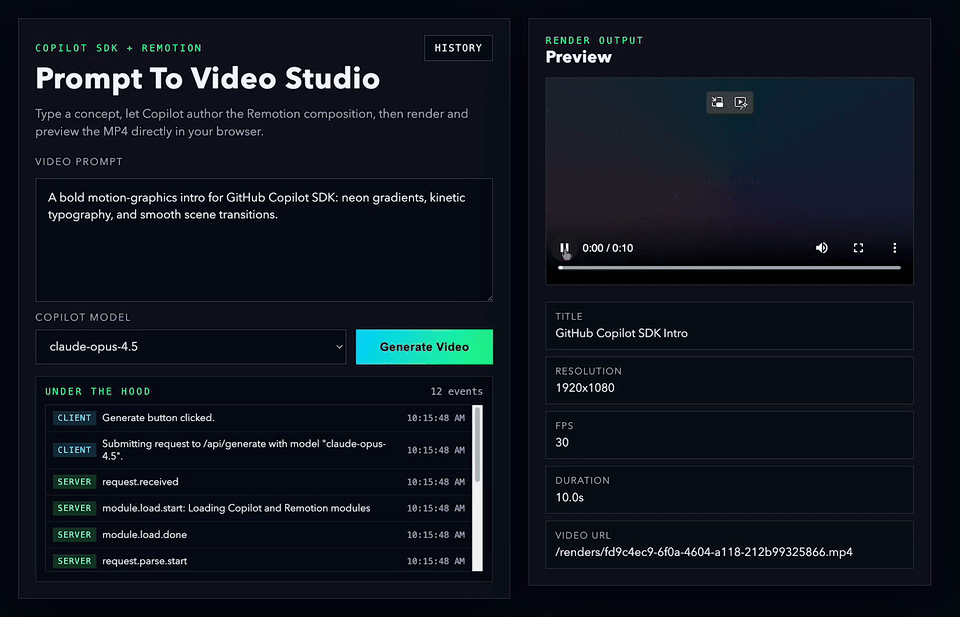

# GitHub Copilot SDK and Remotion Studio

Modern prompt-to-video web app built with [GitHub Copilot SDK](https://github.com/github/copilot-sdk), [Remotion](https://www.remotion.dev/), and Next.js.

Enter a prompt, pick a model, generate a video composition with Copilot, render it to MP4 on the server, and preview it in the browser.



## Features

- Prompt-driven video generation from natural language
- Model selection dropdown (auto-loaded from Copilot SDK)
- Server-side render pipeline using Remotion (`h264` MP4)
- In-app preview with metadata (resolution, FPS, duration)
- Activity timeline showing client + server generation steps
- History modal to browse previously generated videos
- Strict JSON parsing and clearer API error handling
- Sharp-corner, modern UI with animated generate-button loading state

## Tech Stack

- Next.js 15 (App Router)
- React 19 + TypeScript
- `@github/copilot-sdk`
- `remotion`, `@remotion/bundler`, `@remotion/renderer`
- `zod`

## Project Structure

- `app/page.tsx`: Main UI (prompt form, model picker, logs, preview, history modal)
- `app/api/generate/route.ts`: Prompt + model input validation and generate/render orchestration
- `app/api/models/route.ts`: Available model list for dropdown
- `app/api/renders/route.ts`: Generated video history listing
- `lib/copilot.ts`: Copilot session/model handling + Remotion code-spec generation
- `lib/remotion.ts`: Composition bundling + MP4 rendering
- `public/renders/`: Rendered output MP4 files (gitignored)
- `.generated/`: Temporary generated job files (gitignored)

## Requirements

- Node.js 22+ recommended (use a modern Node runtime)
- npm
- GitHub Copilot access
- One auth path:
  - `GITHUB_TOKEN` in `.env.local`, or
  - logged-in local Copilot CLI session

## Quick Start

```bash
npm install
cp .env.example .env.local
npm run dev
```

Open `http://localhost:3000`.

### Environment Variables

`.env.example`:

```bash
# Required unless you are already logged in with Copilot CLI on this machine.
GITHUB_TOKEN=ghp_xxx

# Optional model override. Common values: gpt-5, claude-sonnet-4.5
COPILOT_MODEL=gpt-5
```

## Scripts

```bash
npm run dev       # Start local dev server
npm run build     # Production build
npm run start     # Start production server
npm run lint      # Lint
npm run typecheck # TypeScript checks
```

## API

### `POST /api/generate`

Generates and renders a video.

Request body:

```json
{
  "prompt": "Create an introduction for Cloud Automation Cluster. Orange background and typewriter text.",
  "model": "gpt-5"
}
```

- `prompt`: required, 10-2000 chars
- `model`: optional, falls back to `COPILOT_MODEL` then `gpt-5`

Success response:

```json
{
  "ok": true,
  "jobId": "uuid",
  "videoUrl": "/renders/<jobId>.mp4",
  "metadata": {
    "title": "Generated Remotion Video",
    "width": 1280,
    "height": 720,
    "fps": 30,
    "durationInFrames": 300
  },
  "logs": [
    { "at": "2026-01-01T00:00:00.000Z", "step": "request.received" }
  ]
}
```

Error response:

```json
{
  "ok": false,
  "error": "Message",
  "logs": [
    { "at": "2026-01-01T00:00:00.000Z", "step": "request.failed", "detail": "..." }
  ]
}
```

### `GET /api/models`

Returns available Copilot models for the dropdown. Falls back to default options on error.

### `GET /api/renders`

Returns generated videos from `public/renders/*.mp4` with timestamp and file size.

## Render Outputs

- Final videos: `public/renders/<jobId>.mp4`
- Intermediate generated source: `.generated/jobs/<jobId>/...`

Both are excluded from version control by `.gitignore`.

## How Generation Works

1. Client submits `prompt` + `model` to `/api/generate`
2. Server asks Copilot SDK for a strict JSON video spec including TSX component code
3. Server writes a temporary Remotion entry/root/component job
4. Remotion bundles and renders MP4
5. Video is saved to `public/renders/` and returned to the client for preview

## Troubleshooting

- `Server returned non-JSON response (500)`:
  - The API crashed before returning JSON. Check terminal logs for `/api/generate error:` details.
- `Unexpected token '<' ... is not valid JSON`:
  - The server returned HTML (usually an error page). Same root cause as above; inspect server logs.
- Video seems static or too short:
  - Improve your prompt to request continuous motion and timing across the full clip.
- Model list not loading:
  - App falls back to built-in model options automatically.

## Notes

- Do not commit real tokens to source control.
- Use `.env.local` for local secrets.

